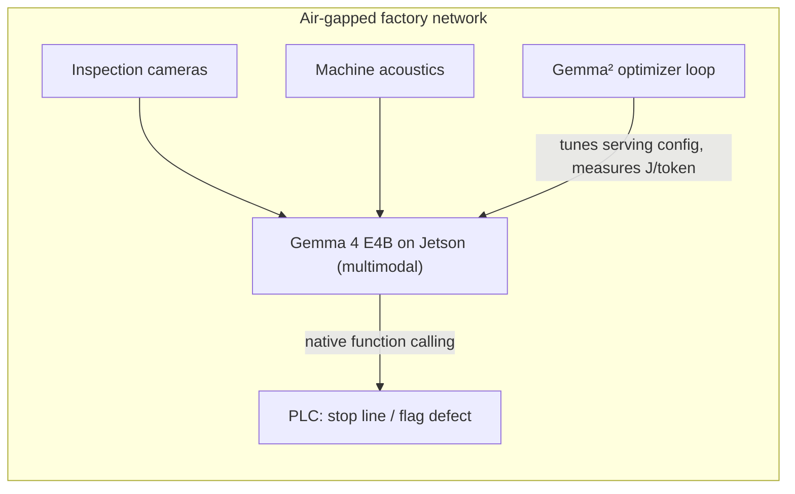

# Gemma²

**Gemma 4 optimizes its own deployment: and explains every decision.**

An autonomous agent built on Gemma 4's native function calling: it benchmarks a live vLLM deployment, reads the metrics (tokens/s, TTFT, joules/token), diagnoses the bottleneck in plain language, acts (quantization, batching, prefix caching, GPU power cap), and re-benchmarks: until gains flatten. Every configuration competes on a live leaderboard, including a hand-tuned human expert baseline.

Built in one day at the Paris Gemma 4 Hackathon (42 Paris). Full writeup on Kaggle.

*Scaffold: full README lands with the code (architecture, quickstart, metrics definitions, guardrails).*

## Optimization levers (the agent's action space, explained)

| Lever | What it does | Typical effect |
|---|---|---|
| `concurrency` (client) | How many requests hit the server at once | The saturation lever: our biggest win (8→64 took 406→1,377 tok/s); raises TTFT, hence the 500 ms guardrail |
| `max_num_seqs` (vLLM) | Max sequences batched together server-side | Ceiling for batching; too high wastes KV memory and queues requests |
| `enable_prefix_caching` | Reuses KV cache across prompts sharing a prefix | Near-free win on templated workloads like ours; cuts prefill work and energy |
| GPU power cap (`nvidia-smi -pl`) | Hardware power ceiling | 5-15% energy for a few % throughput; blocked in most containerized clouds (we report it honestly) |
| Model variant / QAT | Swap to `gemma-4-qat-q4_0` etc. | ~2x throughput and lower J/token for a quality trade-off; QAT keeps quality close |
| Attention backend (`restart_server`) | FLASH_ATTN / TRITON_ATTN / FLASHINFER | Kernel-level differences; workload-dependent, measured not assumed |

Every run documents hardware, model variant, precision and concurrency, and every decision ships with the agent's plain-language diagnosis. Energy is measured with NVML energy-counter deltas, not estimated.

## The recorded session, decision by decision

The full narrative (every agent quote, parameter set, result and outcome, plus the system block describing the exact experimental setup) is in [`assets/sessions/decisions.json`](assets/sessions/decisions.json). Highlights, verbatim from the journal: the agent opened with a deliberate probe ("initiating a baseline probe to establish the current performance ceiling"), diagnosed under-utilization from a healthy TTFT ("concurrency of 1... significantly under-utilizing the H100"), was rejected by its own guardrail at concurrency 128 and adapted ("exceeded the hard guardrail of 64... I will test the maximum allowed"), and converged at 1,377.5 tok/s, beating both the defaults (+239%) and our engineer's hand-tune (+6.8%).

## A concrete deployment: air-gapped Industry 4.0

In a high-precision factory (aerospace, defense) IP protection forbids any internet link. Gemma 4's edge variants (E2B/E4B, natively multimodal) on local hardware such as NVIDIA Jetson can inspect video for microscopic defects, listen to machine acoustics for predictive maintenance, and act agentically through native function calling (for example commanding a PLC to stop a faulty line). No data ever leaves the site; latency stays on the floor. Gemma² is the piece that makes this class of local deployment efficient enough to run.

