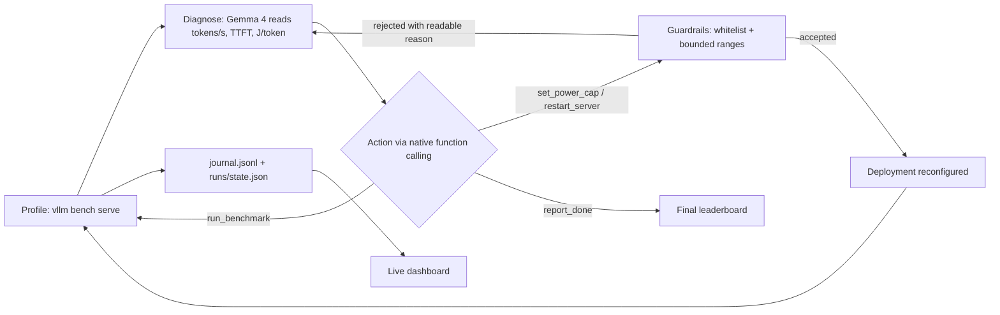
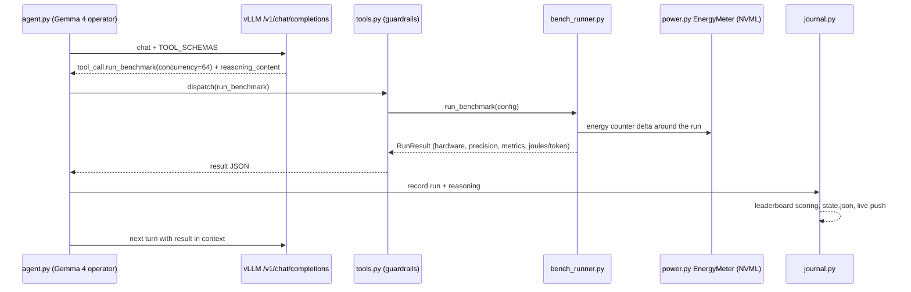
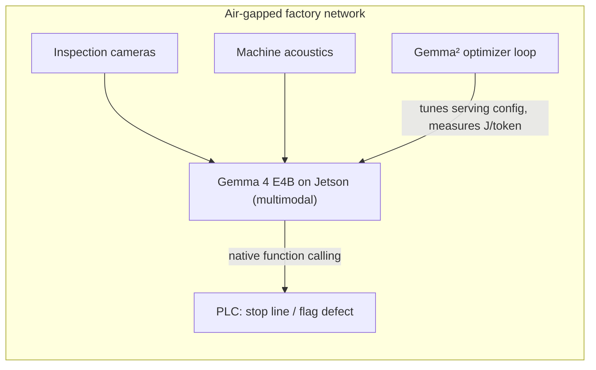
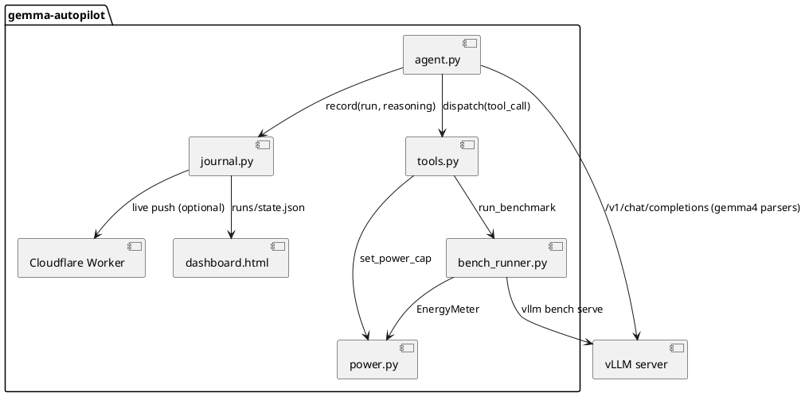
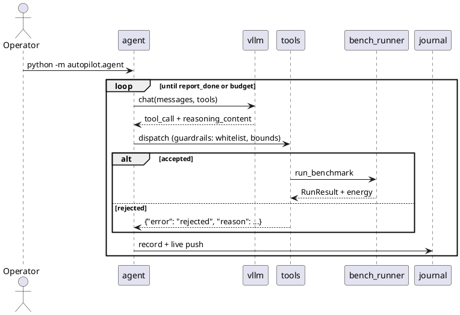

# Architecture and diagrams

Technical documentation for Gemma². Mermaid diagrams render natively on GitHub; PlantUML sources are kept alongside for local rendering (`plantuml -tsvg docs/architecture.md` friendly blocks).

## The feedback loop

## One iteration, end to end

## Edge deployment target: air-gapped Industry 4.0

## PlantUML sources

Component view:

Iteration sequence:

